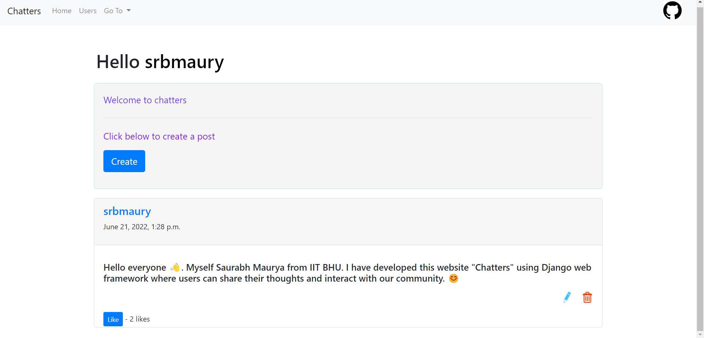
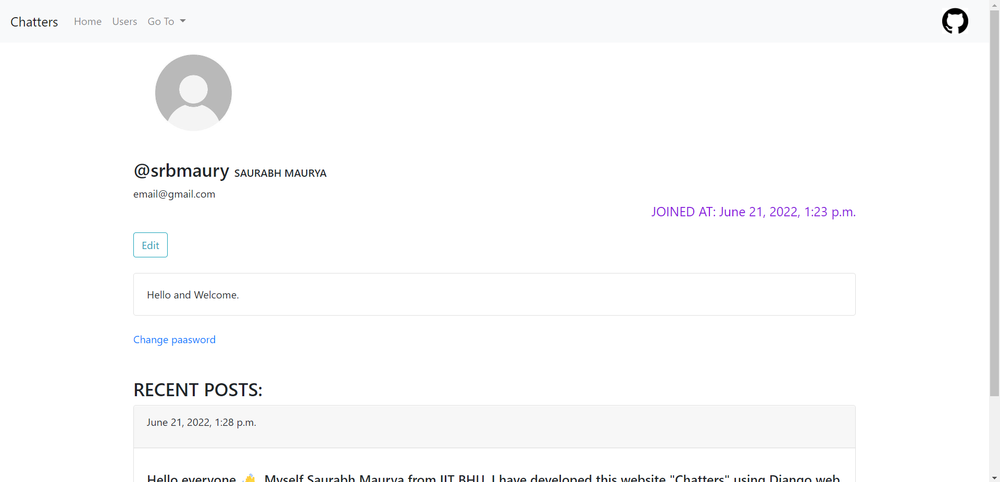

# Chatters

A social meida site using django with email authenticated login system where users can 
- Create account 
- Reset their password
- Create any new post 
- Update their previous posts
- Delete their previous posts 
- Change their password 
- Update their profile picture and bio 
- Check each other's profile 
- See last login time of others 
- See own email
- See when their account was created 

A tab is made which will be visible only to superuser and it contains profiles of all users. 
Default profile picture for each user is provided by [Joe Schmoe API](https://joeschmoe.io/#sandbox).

### Deployed app link: http://srbmaury.pythonanywhere.com/
# SCREENSHOTS
<p align="center">
  <h2> Home Page </h2>
  
  <h2> Profile Page </h2>
  
</p>

## Setup

Clone the repository:

```sh
$ git clone git@github.com:srbmaury/Chatters.git
```


## Installing packages using pip and virtual environments

### Installing pip
pip is the reference Python package manager. It’s used to install and update packages. You’ll need to make sure you have the latest version of pip installed.

```sh
py -m pip install --upgrade pip
py -m pip --version
```
### Installing virtualenv
virtualenv is used to manage Python packages for different projects. Using virtualenv allows you to avoid installing Python packages globally which could break system tools or other projects. You can install virtualenv using pip.

```sh
py -m pip install --user virtualenv
```
### Creating a virtual environment
To create a virtual environment, go to your project’s directory and run venv. If you are using Python 2, you are strongly recommended to use Python 3

```sh
py -m venv env
```

### Activating a virtual environment
```sh
.\env\Scripts\activate
```

Then install the dependencies:

```sh
(env)$ pip install -r requirements.txt
```
Note the `(env)` in front of the prompt. This indicates that this terminal
session operates in a virtual environment set up by `virtualenv2`.

Once `pip` has finished downloading the dependencies move to project directory:
```sh
(env)$ cd Chatters
```
### Creating a superuser
To create a superuser:
```sh
(env)$ python manage.py createsuperuser
```

### Runnig the server
```sh
(env)$ python manage.py runserver
```


And navigate to `http://127.0.0.1:8000/`.
